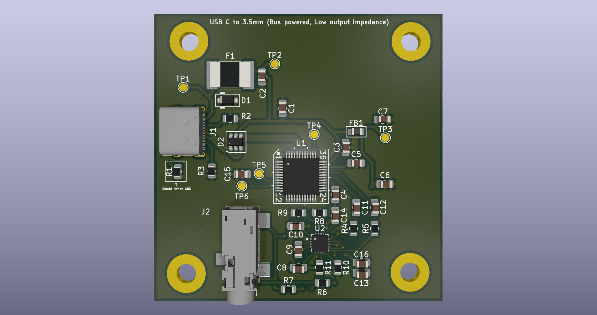
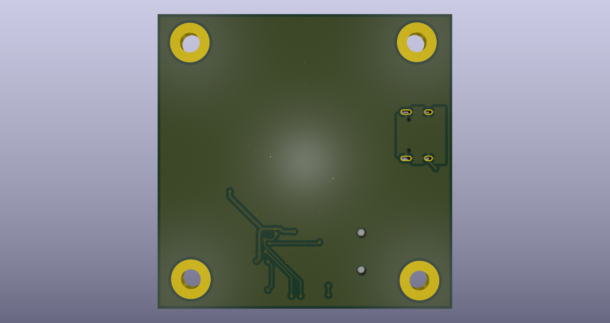

# USB-2-3.5mm
Personal Project to drive analog speakers from USB Type C.
##
I utilized a Cmedia CM108B audio IC and a MAX97720A Amplifier IC. The USB Type C connector is wired with resistors on CC1 and CC2 to allow power draw from the Host. The Cmedia IC then sends an identifier notifying the Host that the device is an audio device, making it load drivers and prepare for audio playthrough. A 90Ω impedance was aimed for in the design, to allow optimal operation on the differential USB data rails. At last, the IC sends the Audio data through its own DACs and internal amplifiers, converting it to analog and being able to be used at the intended 3.5mm output. 

The MAX97220A is set with a gain of 3.52dB and an input impedance of 10k. The output of the MAX IC is wired directly onto the 3.5mm and has an integrated anti-crackle and pop solution inside the IC, which was my main drive to using this IC for amplification.
# PCB 3D KiCAD Renders
1. 

2. 
